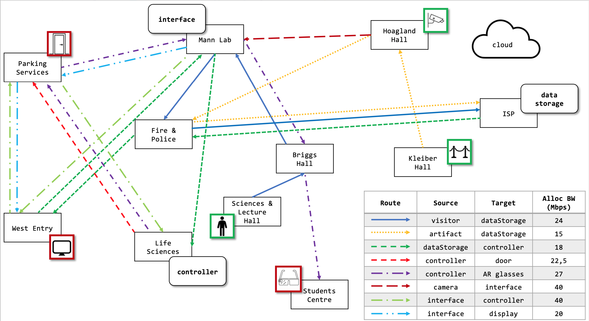

### _Data-aware service placement and routing in the Cloud-IoT continuum_.

DA-Placer methodology is described and assessed in:

> [Jacopo Massa](https://pages.di.unipi.it/massa), [Stefano Forti](https://pages.di.unipi.it/forti), [Antonio Brogi](https://pages.di.unipi.it/brogi)<br>
> [**Data-Aware Service Placement in the Cloud-IoT Continuum**](https://doi.org/10.1007/978-3-031-18304-1_8), <br>	
> Communications in Computer and Information Science, vol 1603 @ [SummerSOC](https://www.summersoc.eu), 2022.

If you wish to reuse source code in this repo, or mention our work, please consider citing the above mentioned article:

```bibtex
@inproceedings{massa2022daplacer,
  title        = {{Data-Aware Service Placement in the Cloud-IoT Continuum}},
  author       = {Massa, Jacopo and Forti, Stefano and Brogi, Antonio},
  year         = 2022,
  booktitle    = {Service-Oriented Computing},
  publisher    = {Springer International Publishing},
  editor       = {Barzen, Johanna and Leymann, Frank and Dustdar, Schahram}
  pages        = {139--158}
}

```

<hr>

**DA-Placer** is a tool for designing and proposing an eligible *placement* and a suitable *routing* strategy for a given service-oriented application within its *data* and requirements, over a given Cloud-IoT infrastructure. 

It exploits the _backtracking_ of the Prolog reasoner to entirely explore the search space of possible solutions, and a _continuous reasoning_ approach to speed-up the decision making process at runtime, after a first eligible solution has been found.

As it is written in Prolog, it is very *declarative* and *concise* (&sime; 170 lines of code), which allows to have a high level of readability and maintainability.

## Files &nbsp;
 - `model.pl` contains the way to describe the application and the infrastructure on which you want to attempt the placement and routing process.

 - `app.pl` and `infrastructure.pl` files contain an instance of the model.

 - `daplacer.pl` contains the main logic of the placer.

## How To &nbsp; 

1. Download or clone this repo. Make sure you have the following prerequisites:

    - [`swipl`](https://www.swi-prolog.org/download/stable)
    - [`python`](https://www.python.org/downloads/) >= 3.6

2. In the project folder, run the following command on terminal, to access the SWI-Prolog console:
    ```console 
    swipl daplacer.pl
    ```

3. Inside the console, run the following query:
    ```prolog
    :- daplacer(museuMonitor, Placement, Routes).
    ```
    The output will be a first placement and routing for the application described in `app.pl` (named _museuMonitor_), onto the infrastructure described in `infrastructure.pl`.

4. To try the _continuous reasoning_, open `infrastructure.pl` file and change some links or nodes involved in the first placement, or change `app.pl` description, adding new services, data types or end-to-end interactions.

4. Repeat _step 2_, and you'll obtain as output a new placement for new and suffering services.

    **N.B.** _Do not terminate the already started `swipl` process, or you will lose the knoweldge base that has been built so far!_

## Output Example &nbsp; 

```prolog
% on(Service, Node)
Placement = [on(dataStorage, isp), 
             on(controller, lifeSciences), 
             on(interface, mannLab)],
```
```prolog
% ((source, target), AllocatedBandwidth, Route)
Routes = [((rVst, dataStorage), 24.0, [sciencesLectureHall, briggsHall, mannLab, parkingServices, westEntry, firePolice, isp]),  
          ((rArt, dataStorage), 15.0, [kleiberHall, hoaglandAnnex, firePolice, isp]),  
          ((dataStorage, controller), 18.0, [isp, firePolice, westEntry, mannLab, lifeSciences]),  
          ((controller, rDor), 22.5, [lifeSciences, parkingServices]),  
          ((controller, rGls), 27.0, [lifeSciences, parkingServices, mannLab, briggsHall, studentCenter]),  
          ((rCam, interface), 40, [hoaglandAnnex, mannLab]),  
          ((interface, controller), 40, [mannLab, westEntry, parkingServices, lifeSciences]),  
          ((interface, rVid), 20, [mannLab, parkingServices, westEntry])]
```
The previous prolog output is depicted in the following image:

<kbd></kbd>


## Contributors  

 - [Jacopo Massa](http://pages.di.unipi.it/massa) (corresponding author)
 - [Stefano Forti](http://pages.di.unipi.it/forti)
 - [Antonio Brogi](http://pages.di.unipi.it/brogi)
